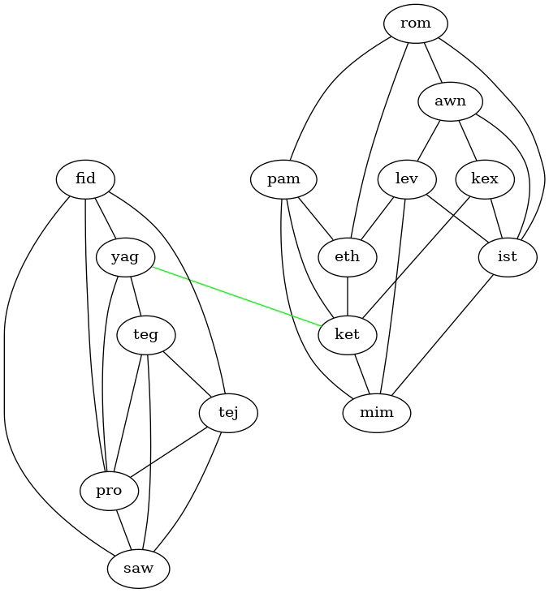



# Tarjan's bridge algorithm

## An iterative implementation

### 2024 Feb 04

Tarjan's bridge algorithm finds _bridges_ in a graph.  A bridge is an edge
whose removal would increase the number of connected components of a graph, i.e.
removing a bridge from a graph of 1 connected component would break it into 2
connected components.  I'll explain this more with figures later, but first
let's dive right into the algorithm.

Here is a non-recursive function that searches for a bridge in graph `g`, in the
component connected to node 0. The function returns the pair of nodes that make
up the first bridge found, or `[-1, -1]` if no bridges are found.

The input graph `g` is represented as a rank-2 array of size `NADJ_CAP` by `nn`,
where `NADJ_CAP` is the max number of adjacent nodes per node and `nn` is the
total number of nodes in the graph.  The slice `g[:,v]` lists the neighbors of
node `v`.  The graph `g` is accompanied by another array `num_adj`.  The number
of neighbors of node `v` is `num_adj[v]`.

<!-- Tab link buttons -->

  <button class="tablinks_0" onclick="open_tab(event, 'syntran', '_0')" id="default_open_0">syntran</button>
  <button class="tablinks_0" onclick="open_tab(event, 'c', '_0')">C</button>

<!-- Tab content -->


fn get_bridge(g: [i32; :, :], num_adj: [i32; :]): [i32; :]
{
	// Stack for iterative (non-recursive) depth-first search
	let nn = size(num_adj, 0);
	let STACK_CAP = 16 * nn;
	let stack = [0; STACK_CAP];
	let sp = -1; // stack "pointer"

	// Push node 0 as root
	stack[(sp += 1)] = 0;

	let visited = [false; nn];
	let defer   = [false; nn];
	let parent  = [-1   ; nn];
	let low     = [-1   ; nn];
	let dists   = [-1   ; nn];

	let dist = 0;
	let found = false;
	let bridge = [-1, -1];
	while sp >= 0 and not found
	{
		let v = stack[(sp -= 1) + 1]; // pop
		if not visited[v]
		{
			low[v]   = dist;
			dists[v] = dist;
			dist += 1;
		}
		visited[v] = true;

		for iw in [0: num_adj[v]]
		{
			let w = g[iw, v];
			if w == parent[v]
			{
				// Do nothing
			}
			else if visited[w]
				low[v] = min(low[v], dists[w]);
			else
			{
				parent[w] = v;

				// re-push parent for deferred processing
				stack[(sp += 1)] = v;
				check_stack_cap(sp, STACK_CAP);
				defer[v] = true;

				// push child. order matters wrt parent
				stack[(sp += 1)] = w;
				check_stack_cap(sp, STACK_CAP);
			}
		}

		if defer[v]
		{
			for iw in [0: num_adj[v]]
			{
				let w = g[iw, v];
				if w != parent[v] and visited[w]
				{
					low[v] = min(low[v], low[w]);
					if (low[w] > dists[v])
					{
						bridge = [v, w];
						found = true;
					}
				}
			}
		}
	}
	let ans = bridge;
}


<!-- ******** -->


int* get_bridge(int* g, int* num_adj, int nn)
{
	// Stack for iterative (non-recursive) depth-first search
	int STACK_CAP = 16 * nn;
	int* stack = malloc(STACK_CAP * sizeof(int));
	memset(stack, 0, sizeof(stack));
	int sp = -1; // stack "pointer"

	// Push node 0 as root
	stack[(sp += 1)] = 0;

	bool* visited = malloc(nn * sizeof(bool));
	bool* defer   = malloc(nn * sizeof(bool));
	int*  parent  = malloc(nn * sizeof(int));
	int*  low     = malloc(nn * sizeof(int));
	int*  dists   = malloc(nn * sizeof(int));

	memset(visited, false, nn * sizeof(bool));
	memset(defer  , false, nn * sizeof(bool));
	memset(parent , -1   , nn * sizeof(int));
	memset(low    , -1   , nn * sizeof(int));
	memset(dists  , -1   , nn * sizeof(int));

	int dist = 0;
	bool found = false;
	int* bridge = malloc(2 * sizeof(int)); bridge[0] = -1; bridge[1] = -1;
	while (sp >= 0 && !found)
	{
		int v = stack[(sp -= 1) + 1]; // pop
		if (!visited[v])
		{
			low[v]   = dist;
			dists[v] = dist;
			dist += 1;
		}
		visited[v] = true;

		for (int iw = 0; iw < num_adj[v]; iw++)
		{
			int w = g[v * NADJ_CAP + iw];
			if (w == parent[v])
			{
				// Do nothing
			}
			else if (visited[w])
				low[v] = min(low[v], dists[w]);
			else
			{
				parent[w] = v;

				// Re-push parent for deferred processing
				stack[(sp += 1)] = v;
				//check_stack_cap(sp, STACK_CAP); // TODO
				defer[v] = true;

				// Push child. order matters wrt parent
				stack[(sp += 1)] = w;
				//check_stack_cap(sp, STACK_CAP); // TODO
			}
		}

		if (defer[v])
		{
			for (int iw = 0; iw < num_adj[v]; iw++)
			{
				int w = g[v * NADJ_CAP + iw];
				if ((w != parent[v]) && visited[w])
				{
					low[v] = min(low[v], low[w]);
					if (low[w] > dists[v])
					{
						bridge[0] = v; bridge[1] = w;
						found = true;
					}
				}
			}
		}
	}
	return bridge;
}


<!----------------------------------------------------------------------------->

## Why iterative instead of recursive?

I first learned about Tarjan's bridge algorithm while working on an [Advent of
Code problem](https://adventofcode.com/2023/day/25) in my programming language
[syntran](https://github.com/JeffIrwin/syntran).  It turned out that searching
for bridges wasn't a great way to solve this problem, but that's beside the
point.

One of the many features that the syntran language currently lacks is
[recursion](https://www.google.com/search?channel=fs&client=ubuntu-sn&q=recursion).
Fortunately, recursive algorithms, such as binary search, breadth-first search,
depth-first search, or even [quick
sort](https://github.com/JeffIrwin/syntran/blob/538b979bf3d42777a5d541e8416fd65e2f0df64f/src/tests/long/aoc/2023/22/main.syntran#L17),
can always be translated to an equivalent iterative algorithm using stacks or
queues.

There are plenty of online resources which present [recursive
versions](https://cp-algorithms.com/graph/bridge-searching.html) of Tarjan's
bridge algorithm, but I couldn't find any iterative versions.  It wasn't
straightforward to come up with one, since there is some tricky state in the
algorithm regarding the way that _deferred_ nodes are processed.

## What is a bridge?

A graph is an abstract mathematical entity with diverse applications for road
networks and communication networks.  In the case of road networks, a bridge in
a graph is like a literal bridge.

To be precise, a bridge is an edge whose removal increases the number of
connected components of a graph.  This is best explained with a visual example,
like Figure 1.

|  |
| Figure 1: A graph with a bridge, colored green, between nodes `yag` and `ket` |

In this example, removing the edge between the nodes `yag` and `ket` would split
the graph into 2 (dis)connected components: one in the lower-left on the `yag`
side, and a separate component on in the upper-right on the `ket` side.

A graph can have more than one bridge, and graphs which have multiple connected
components to begin with can also have bridges which would cut off an
additional component.

## Reading the graph

Before calling the `get_bridge()` function, there is a parsing problem.  In the
Advent of Code, the graph is given in a format like this:


teg: pro tej saw
awn: lev kex ist
pam: eth ket mim
yag: teg pro ket
eth: ket
kex: ist ket
fid: yag saw tej pro
lev: eth mim ist
pro: saw
tej: pro saw
ket: mim
ist: mim
rom: eth pam ist awn


On each line, the node to the left of the colon (e.g. `teg`) is connected to
every node to the right of the colon (e.g. `pro`, `tej`, and `saw`).  This is
the same graph shown in Figure 1.

Notice the node name `teg` appears twice in this file, and `pro` appears five
times.  First, we have to find the set of unique node names and construct the
`g` and `num_adj` arrays.

<!-- TODO: more description.  Present whole read_aoc_graph() fn and related fns? -->

## Calling the get_bridge() function

<!-- Tab link buttons -->

  <button class="tablinks_1" onclick="open_tab(event, 'syntran', '_1')" id="default_open_1">syntran</button>
  <button class="tablinks_1" onclick="open_tab(event, 'c', '_1')">C</button>

<!-- Tab content -->


fn main(): i32
{
	read_aoc_graph(filename_glbl);

	let bridge = get_bridge(g_glbl, num_adj_glbl);
	if bridge[0] < 0
		println("No bridges were found");
	else
		println("Found bridge between nodes ", bridge, " = ",
				[names_glbl[bridge[0]], names_glbl[bridge[1]]]);

	let ans = 0;
}


<!-- ******** -->


int main()
{
	read_aoc_graph(filename_glbl);

	int* bridge = get_bridge(g_glbl, num_adj_glbl, num_nodes);
	if (bridge[0] < 0)
		println("No bridges were found");
	else
		printf("Found bridge between nodes [%d, %d] = [%s, %s]\n",
				bridge[0], bridge[1], names_glbl[bridge[0]], names_glbl[bridge[1]]);

	return 0;
}


## Open questions

<!----------------------------------------------------------------------------->

